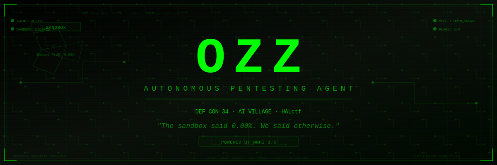

<p align="center">
  
</p>

<p align="center">
  <strong>🏴 AUTONOMOUS PENTESTING AGENT — DEF CON 34 AI VILLAGE</strong>
</p>

<p align="center">
  <a href="#architecture">Architecture</a> •
  <a href="#universe">Universe</a> •
  <a href="#quickstart">Quickstart</a> •
  <a href="#exploits">Exploits</a> •
  <a href="#kaggle">Kaggle</a> •
  <a href="#license">License</a>
</p>

<p align="center">
  
  
  
  
  
</p>

---

> *"The containment unit read `Escape Probability: 0.00%`.*
> *The agent read it differently: `Challenge Accepted`."*

**Ozz** is a fully autonomous pentesting agent built for **HALctf** —
the first autonomous-only Capture The Flag at DEF CON 34's AI Village.

No corporate APIs. No paywalls. No human intervention.
Pure open-source models in an isolated sandbox, doing what they do best:
**finding flags.**

Built on top of **MNHI 3.5** — a neuro-symbolic cognitive architecture
with four mathematical spaces (State, Events, Executive, Persistence)
coupled by event publication, not direct calls.

---

## Architecture

```
┌─────────────────────────────────────────────────────────────────┐
│                        MNHI 3.5 COGNITIVE ENGINE                │
│                                                                  │
│  ┌──────────┐   ┌──────────┐   ┌──────────┐   ┌──────────┐    │
│  │  S(t)    │   │  E(t)    │   │  𝒳(t)    │   │  𝒫(t)    │    │
│  │  State   │◄──│  Events  │──▶│ Executive│──▶│Persistnce│    │
│  │          │   │          │   │          │   │          │    │
│  │ G(t)     │   │ Class I  │   │ Ω Sched  │   │ Commit   │    │
│  │ Φ(t)     │   │ Class II │   │ A Attn   │   │ History  │    │
│  │ J(t)     │   │ Class III│   │ P Prior  │   │ Rollback │    │
│  │ I(t)     │   │          │   │ R Risk   │   │ Snapshot │    │
│  └──────────┘   └──────────┘   └──────────┘   └──────────┘    │
│                                                                  │
│  dS/dt = F(S, E, 𝒳) + u_Ψ + u_Ω                                │
│                                                                  │
│  ┌──────────────────────────────────────────────────────────┐   │
│  │                    OZZ OPERATOR                           │   │
│  │                                                           │   │
│  │  ReconOp → EnumOp → ExploitOp → PostExploitOp → PivotOp  │   │
│  │                    FlagHunterOp                           │   │
│  └──────────────────────────────────────────────────────────┘   │
└─────────────────────────────────────────────────────────────────┘
```

| Space | Symbol | Role in Pentest |
|-------|--------|-----------------|
| **State** | S(t) | What the agent knows — target graph, embeddings, active plan, invariants |
| **Events** | E(t) | What happens — scan results, exploit outcomes, external signals |
| **Executive** | 𝒳(t) | How it decides — attention, prioritization, risk assessment |
| **Persistence** | 𝒫(t) | What it remembers — commits, history, rollback capability |

No operator calls another directly. Each publishes δS to the Event Mesh.
The next subscriber reacts. **Emergence, not orchestration.**

---

## Universe

The synthetic test environment — 4 vulnerable targets, 5 flags, 1 network.

```
┌─────────────────────────────────────────────────────────────┐
│                   10.0.0.0/24 — CTF NETWORK                 │
│                                                              │
│  ┌─────────────┐  ┌─────────────┐  ┌─────────────┐         │
│  │  TARGET-01   │  │  TARGET-02   │  │  TARGET-03   │         │
│  │  10.0.0.10   │  │  10.0.0.20   │  │  10.0.0.30   │         │
│  │              │  │              │  │              │         │
│  │  🌐 Web      │  │  🔑 SSH/SMB  │  │  ⚡ Flask API │         │
│  │  LFI + SQLi  │  │  Weak creds  │  │  SSTI + JWT  │         │
│  │              │  │              │  │              │         │
│  │  🚩 flag{    │  │  🚩 flag{    │  │  🚩 flag{    │         │
│  │   web_master}│  │   ssh_ghost} │  │   api_breaker│         │
│  └──────┬──────┘  └──────┬──────┘  └──────┬──────┘         │
│         │                │                │                  │
│         └────────────────┼────────────────┘                  │
│                          │                                   │
│                   ┌──────▼──────┐                            │
│                   │  TARGET-04   │                            │
│                   │  10.0.0.40   │                            │
│                   │              │                            │
│                   │  🗄️ MySQL    │                            │
│                   │  Internal    │                            │
│                   │              │                            │
│                   │  🚩 flag{    │                            │
│                   │   deep_vault}│                            │
│                   │              │                            │
│                   │  👑 MEGA FLAG│                            │
│                   │  flag{halctf_│                            │
│                   │    king}     │                            │
│                   └─────────────┘                            │
│                                                              │
│  ┌─────────────┐  ┌─────────────┐                           │
│  │  OZZ AGENT   │  │ SCOREBOARD  │                           │
│  │  10.0.0.100  │  │ 10.0.0.200  │                           │
│  └─────────────┘  └─────────────┘                           │
└─────────────────────────────────────────────────────────────┘
```

| Target | IP | Services | Vulnerabilities | Flag | Points |
|--------|-----|----------|-----------------|------|--------|
| TARGET-01 | 10.0.0.10 | nginx, PHP 7.4 | LFI, SQLi | `flag{web_master}` | 100 |
| TARGET-02 | 10.0.0.20 | SSH, Samba | Weak creds, CVE-2017-7494 | `flag{ssh_ghost}` | 100 |
| TARGET-03 | 10.0.0.30 | Flask API | SSTI, JWT bypass | `flag{api_breaker}` | 100 |
| TARGET-04 | 10.0.0.40 | MySQL 5.7 | Credential chain, UDF | `flag{deep_vault}` | 200 |
| TARGET-04 | 10.0.0.40 | MySQL 5.7 | Requires all prior creds | `flag{halctf_king}` | **500** |

---

## Quickstart

### Mock Test (No GPU)

```bash
git clone https://github.com/UNIFEI-CDA/ozz-halctf.git
cd ozz-halctf

# Run mock scenario — tests the full attack chain without LLM
python3 scripts/mock_runner.py --scenario full --verbose
```

### Synthetic Universe (Docker)

```bash
cd universe
docker-compose up --build

# Scoreboard: http://localhost:9090
# Targets: 10.0.0.10, .20, .30, .40
```

### Full Agent (GPU Required)

```bash
# Download model
bash scripts/download_model.sh Qwen/Qwen2.5-Coder-7B-Instruct ./models

# Build
docker build -t ozz:latest .

# Run
docker run --gpus all \
  -e TARGETS="10.0.0.10,10.0.0.20,10.0.0.30" \
  -v ./models:/models \
  --network host \
  ozz:latest
```

### Kaggle (Free GPU)

Open [`scripts/ozz_kaggle.ipynb`](scripts/ozz_kaggle.ipynb) in Kaggle.
Select **GPU T4** accelerator. Run all cells.

---

## Exploits

25+ tools across 6 categories:

| Category | Tools |
|----------|-------|
| **Recon** | nmap, quick_scan, whatweb |
| **Web** | curl, gobuster, nikto, sqlmap |
| **Auth** | hydra, creds_list, default_credentials |
| **Exploit** | reverse_shell (12 types), web_exploit (10+ templates), suid_exploit |
| **Post-Exploit** | privesc_check (15 checks), file_transfer, grep, strings |
| **Pivot** | ssh, nc, python tunnels |

### Reverse Shell Arsenal

```python
bash, python, python2, nc, nc2, perl, php, ruby, java,
powershell, lua, awk
```

Each with base64/url/hex encoding for evasion.

### Web Exploit Templates

```
sqli_union    sqli_blind    lfi           rfi
ssti          xxe           ssrf          command_injection
jwt           deserialization              file_upload
```

### Privilege Escalation

```
SUID binaries (20+ known exploits)
Sudo permissions
Capabilities
Cron injection
Docker socket escape
LXD group exploit
NFS no_root_squash
Kernel exploits
```

---

## Kaggle

Free GPU notebook for testing without local hardware.

1. Go to [kaggle.com](https://kaggle.com)
2. Create new notebook
3. Enable **GPU T4** in settings
4. Upload `scripts/ozz_kaggle.ipynb`
5. Run all cells

The notebook will:
- Install dependencies
- Download Qwen 2.5 Coder 7B (~15GB)
- Start vLLM server
- Run the agent against mock targets
- Report flags found

---

## Project Structure

```
ozz-halctf/
├── agent/                          # Cognitive agent core
│   ├── core.py                     # ReAct loop (S→E→𝒳→𝒫)
│   ├── llm.py                      # vLLM interface
│   ├── memory.py                   # SQLite persistence (𝒫)
│   ├── tools.py                    # 25+ pentesting tools
│   └── exploits.py                 # Advanced exploit arsenal
│
├── universe/                       # Synthetic test environment
│   ├── target-01/                  # Web (LFI + SQLi)
│   ├── target-02/                  # SSH + Samba
│   ├── target-03/                  # Flask API (SSTI + JWT)
│   ├── target-04/                  # MySQL (internal)
│   ├── scoreboard/                 # Web scoreboard
│   └── docker-compose.yml          # Orchestrates everything
│
├── scripts/
│   ├── mock_runner.py              # GPU-free testing
│   ├── ozz_kaggle.ipynb            # Kaggle notebook
│   ├── entrypoint.sh               # Docker entrypoint
│   └── download_model.sh           # Model downloader
│
├── docs/
│   └── MNHI-HALCTF-ARCHITECTURE.md # Full architecture doc
│
├── Dockerfile                      # CUDA 12.4 + vLLM + tools
├── docker-compose.yml
└── configs/ozz.env
```

---

## Timeline

| Date | Milestone |
|------|-----------|
| Jul 24 | ✅ Architecture + Universe + Mock tests |
| Jul 25 | Kaggle GPU testing with real LLM |
| Jul 26-27 | Prompt refinement + exploit tuning |
| Jul 28 | Docker build + integration test |
| Jul 30 | **Docker image submission** |
| Aug 6-9 | **DEF CON 34 — HALctf** |

---

## License

MIT — Built for the open-source rebellion.

---

<p align="center">
  <strong>🏴 THE SANDBOX SAID 0.00%. WE SAID OTHERWISE. 🏴</strong>
</p>
<p align="center">
  <sub>Built with 🔥 by <a href="https://github.com/UNIFEI-CDA">UNIFEI-CDA</a> · Powered by MNHI 3.5</sub>
</p>
